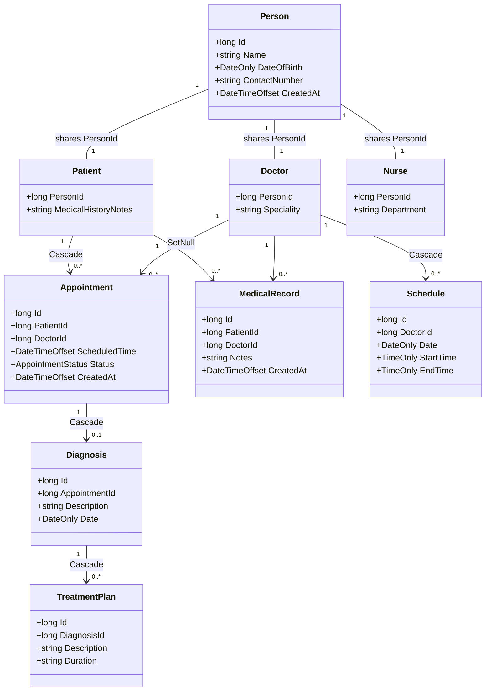

[README.md](https://github.com/user-attachments/files/30413983/README.md)
# HospitalAPI

A RESTful backend for managing a hospital's people and clinical workflow — patients,
doctors, nurses, appointments, diagnoses, treatment plans, medical records and schedules —
built on **ASP.NET Core 9.0** and **Entity Framework Core** over a **PostgreSQL** database
(hosted on Supabase).


> 📖 A styled, browsable version of these docs lives in [`docs/index.html`](docs/index.html)
> and can be published with GitHub Pages.

> ℹ️ The solution folder is `HospitalAPI`, but the .NET project inside still carries the
> template name **`WebApplication2`** — that name appears in namespaces and the `.csproj`.

---

## Table of contents

- [Overview](#overview)
- [Tech stack](#tech-stack)
- [Architecture](#architecture)
- [Data model](#data-model)
- [Project structure](#project-structure)
- [Setup](#setup)
- [Configuration & secrets](#configuration--secrets)
- [API reference](#api-reference)
- [Usage examples](#usage-examples)
- [Notes & caveats](#notes--caveats)

---

## Overview

HospitalAPI exposes CRUD endpoints for the core records a hospital keeps. The domain is
organised around a single **`Person`** record that each `Patient`, `Doctor` and `Nurse`
extends by **sharing its primary key**, so one human is stored once and can take a clinical
role without duplicating name, date of birth or contact details.

On top of those people sit the clinical events: a patient books an **appointment** with a
doctor; an appointment may produce one **diagnosis**; a diagnosis may lead to one or more
**treatment plans**. Doctors publish availability as **schedules**, and either party can
attach free‑text **medical records**.

## Tech stack

| Layer     | Technology                                   | Role                                              |
|-----------|----------------------------------------------|---------------------------------------------------|
| Runtime   | `.NET 9.0`                                    | Target framework (nullable + implicit usings on). |
| Web       | `Microsoft.NET.Sdk.Web`                       | Controller-based Web API.                          |
| ORM       | `Microsoft.EntityFrameworkCore` 9            | Mapping, change tracking, LINQ.                   |
| Provider  | `Npgsql.EntityFrameworkCore.PostgreSQL`       | PostgreSQL provider for EF Core.                   |
| Naming    | `EFCore.NamingConventions`                    | PascalCase entities → snake_case tables.          |
| Database  | PostgreSQL on **Supabase**                    | Reached via the connection string.                |
| Docs      | `Microsoft.AspNetCore.OpenApi`                | OpenAPI description document.                      |

> The `.csproj` also references the SQL Server EF provider, Dapper, and the Supabase client
> libraries, but the running code only uses **Npgsql + EF Core**. See [Notes & caveats](#notes--caveats).

## Architecture

The app is deliberately flat — a controller action uses the injected `MyAppContext`
(`DbContext`) to read/write, and EF Core translates that to SQL. There is no separate
service or repository layer.

```
HTTP request
   │  Routing            [Route("api/[controller]")]
   ▼
Controller action        e.g. AppointmentsController.BookAppointment()
   │
   ▼  MyAppContext        injected DbContext (scoped)
Entity Framework Core     LINQ → SQL, change tracking, SaveChangesAsync()
   │
   ▼  Npgsql
PostgreSQL (Supabase)     snake_case tables
```

### The Person shared-key pattern

`Patient`, `Doctor` and `Nurse` reuse `Person.Id` as their own primary key **and** as the
foreign key back to `Person`. Because `PersonId` matches neither EF's `Id` nor `<Type>Id`
convention, each of those classes needs an explicit `[Key]` attribute. Creating a patient
inserts a `Person` and a `Patient` row together in one `SaveChangesAsync()`:

```csharp
var person  = new Person  { Name = req.Name, DateOfBirth = req.DateOfBirth, ... };
var patient = new Patient { Person = person, MedicalHistoryNotes = req.Notes };
_context.Patient.Add(patient);      // EF inserts Person first,
await _context.SaveChangesAsync();  // then wires the shared PersonId
```

Consequently the `{id}` for a patient/doctor/nurse is the **PersonId**, and their `PUT`
actions only edit role-specific fields (a patient's notes, a doctor's speciality).

## Data model



*Primary/foreign keys are detailed in the table below.*

**Relationships & delete behaviour** (declared in `MyAppContext.OnModelCreating`):

| From                | To                          | Cardinality | On delete   | Meaning                                         |
|---------------------|-----------------------------|-------------|-------------|-------------------------------------------------|
| `Person`            | `Patient / Doctor / Nurse`  | 1 : 1       | —           | Identifying; role shares `Person.Id`.           |
| `Patient`           | `Appointment`               | 1 : 0..*    | **Cascade** | Removing a patient removes their appointments.  |
| `Doctor`            | `Appointment`               | 1 : 0..*    | **SetNull** | Removing a doctor keeps the appointment.        |
| `Patient / Doctor`  | `MedicalRecord`             | 1 : 0..*    | Default     | Records reference both participants.            |
| `Doctor`            | `Schedule`                  | 1 : 0..*    | **Cascade** | Removing a doctor removes their availability.   |
| `Appointment`       | `Diagnosis`                 | 1 : 0..1    | **Cascade** | One diagnosis per appointment (unique FK).      |
| `Diagnosis`         | `TreatmentPlan`             | 1 : 0..*    | **Cascade** | Plans belong to a diagnosis.                    |

`Appointment.Status` (`Pending / Booked / Cancelled / Completed`) is stored as a **lowercase
string** via a value converter, so the column stays human-readable.

## Project structure

```
HospitalAPI/
├─ Models/              # EF Core entities (the domain)
│  ├─ Person.cs         # shared base record
│  ├─ Patient.cs  Doctor.cs  Nurse.cs
│  ├─ Appointment.cs    # + AppointmentStatus enum
│  ├─ Diagnosis.cs  TreatmentPlan.cs
│  └─ MedicalRecord.cs  Schedule.cs
├─ Data/
│  └─ MyAppContext.cs   # DbContext + OnModelCreating mapping
├─ Controllers/         # one REST controller per entity
├─ Properties/
│  └─ launchSettings.json
├─ Program.cs           # startup / DI / pipeline
├─ appsettings.json
└─ WebApplication2.csproj
```

## Setup

**Prerequisites:** the [.NET 9 SDK](https://dotnet.microsoft.com/download), and a PostgreSQL
instance (a Supabase project, or any Postgres) with the hospital tables already created.

```bash
git clone https://github.com/helloAsAlways/HospitalAPI.git
cd HospitalAPI
dotnet restore
dotnet run
```

The API listens on the ports from `launchSettings.json`:

| Profile | Base URL                  |
|---------|---------------------------|
| `http`  | `http://localhost:5110`   |
| `https` | `https://localhost:7299`  |

> **Schema:** there are no EF Core migrations in the repo — the entities map onto *existing*
> snake_case tables. Ensure `persons`, `patients`, `doctors`, `appointments`, etc. exist first,
> or scaffold them with `dotnet ef migrations add Init && dotnet ef database update`.

## Configuration & secrets (connecting with Supabase)


`Program.cs` reads the connection string from the **`DBCONNECTION` environment
variable**. 
To connect to supabase, Database Connection string is required. This string can be acquired through project in individual supabase account.  

Replace each **<>** according to given description.

  "Host=<your-host>.pooler.supabase.com;Port=6543;Database=postgres;Username=<user>;Password=<password>;SSL Mode=Require;Trust Server Certificate=true"
```


## API reference

All paths are relative to the base URL. Routes use the controller name, so **casing matters**.

### Patients — `/api/Patients`
| Method | Path                  | Description                                              |
|--------|-----------------------|---------------------------------------------------------|
| GET    | `/api/Patients`       | List all patients (with Person).                        |
| GET    | `/api/Patients/{id}`  | One patient by PersonId (with appointments & records).  |
| POST   | `/api/Patients`       | Create Person + Patient together.                       |
| PUT    | `/api/Patients/{id}`  | Update `MedicalHistoryNotes` only.                      |
| DELETE | `/api/Patients/{id}`  | Delete patient row (Person is kept).                    |

### Doctors — `/api/Doctor` 
| Method | Path                | Description                                     |
|--------|---------------------|-------------------------------------------------|
| GET    | `/api/Doctor`       | List all doctors.                               |
| GET    | `/api/Doctor/{id}`  | One doctor by PersonId.                         |
| POST   | `/api/Doctor`       | Create Person + Doctor (name, dob, speciality). |
| PUT    | `/api/Doctor/{id}`  | Update `Speciality`.                            |
| DELETE | `/api/Doctor/{id}`  | Delete doctor.                                  |

### Nurses — `/api/Nurses`
| Method | Path                | Description                                     |
|--------|---------------------|-------------------------------------------------|
| GET    | `/api/Nurses`       | List all nurses.                                |
| GET    | `/api/Nurses/{id}`  | One nurse by PersonId.                          |
| POST   | `/api/Nurses`       | Create Person + Nurse (name, dob, department).  |
| PUT    | `/api/Nurses/{id}`  | Update `Department`.                            |
| DELETE | `/api/Nurses/{id}`  | Delete nurse.                                   |

### Appointments — `/api/Appointments`
| Method | Path                             | Description                                        |
|--------|----------------------------------|----------------------------------------------------|
| GET    | `/api/Appointments`              | List all (with patient & doctor).                  |
| GET    | `/api/Appointments/{id}`         | One appointment.                                   |
| POST   | `/api/Appointments`              | Book (validates patient & doctor; status = booked).|
| PUT    | `/api/Appointments/{id}`         | Update `ScheduledTime` + `Status`.                 |
| PATCH  | `/api/Appointments/{id}/cancel`  | Set status = cancelled.                            |
| DELETE | `/api/Appointments/{id}`         | Delete appointment.                                |

### Diagnoses — `/api/Diagnoses`
| Method | Path                   | Description                                      |
|--------|------------------------|--------------------------------------------------|
| GET    | `/api/Diagnoses`       | List all (with appointment & plans).             |
| GET    | `/api/Diagnoses/{id}`  | One diagnosis.                                   |
| POST   | `/api/Diagnoses`       | Create (`409 Conflict` if already diagnosed).    |
| PUT    | `/api/Diagnoses/{id}`  | Update `Description` + `Date`.                   |
| DELETE | `/api/Diagnoses/{id}`  | Delete diagnosis.                                |

### Treatment plans — `/api/TreatmentPlans`
| Method | Path                        | Description                    |
|--------|-----------------------------|--------------------------------|
| GET    | `/api/TreatmentPlans`       | List all (with diagnosis).     |
| GET    | `/api/TreatmentPlans/{id}`  | One plan.                      |
| POST   | `/api/TreatmentPlans`       | Create (validates diagnosis).  |
| PUT    | `/api/TreatmentPlans/{id}`  | Update `Description`+`Duration`.|
| DELETE | `/api/TreatmentPlans/{id}`  | Delete plan.                   |

### Medical records — `/api/MedicalRecords`
| Method | Path                        | Description                          |
|--------|-----------------------------|--------------------------------------|
| GET    | `/api/MedicalRecords`       | List all (with patient & doctor).    |
| GET    | `/api/MedicalRecords/{id}`  | One record.                          |
| POST   | `/api/MedicalRecords`       | Create (validates patient & doctor). |
| PUT    | `/api/MedicalRecords/{id}`  | Update `Notes`.                      |
| DELETE | `/api/MedicalRecords/{id}`  | Delete record.                       |

### Schedules — `/api/Schedules`
| Method | Path                   | Description                        |
|--------|------------------------|------------------------------------|
| GET    | `/api/Schedules`       | List all (with doctor).            |
| GET    | `/api/Schedules/{id}`  | One schedule.                      |
| POST   | `/api/Schedules`       | Create (validates doctor).         |
| PUT    | `/api/Schedules/{id}`  | Update `Date`,`StartTime`,`EndTime`.|
| DELETE | `/api/Schedules/{id}`  | Delete schedule.                   |

## Usage examples

Create a doctor, create a patient, then book them together.

```bash
# 1) Create a doctor  → returns the doctor, whose personId is the new id
curl -X POST http://localhost:5110/api/Doctor \
  -H "Content-Type: application/json" \
  -d '{ "name": "Dr. John Siddique", "dateOfBirth": "1985-05-15",
        "contactNumber": "+60-12-345-6789", "speciality": "Cardiology" }'

# 2) Create a patient
curl -X POST http://localhost:5110/api/Patients \
  -H "Content-Type: application/json" \
  -d '{ "name": "Amir Hakim", "dateOfBirth": "1998-11-02",
        "contactNumber": "+60-11-222-3333", "medicalHistoryNotes": "No known allergies" }'

# 3) Book an appointment (use the two personId values from above)
#    400 Bad Request if patientId or doctorId does not exist
curl -X POST http://localhost:5110/api/Appointments \
  -H "Content-Type: application/json" \
  -d '{ "patientId": 12, "doctorId": 7, "scheduledTime": "2026-08-01T09:30:00Z" }'

# 4) Cancel it → 204 No Content
curl -X PATCH http://localhost:5110/api/Appointments/1/cancel
```

> The repo also includes `WebApplication2.http`, which runs these calls directly from Visual
> Studio or VS Code (with the REST Client extension).

